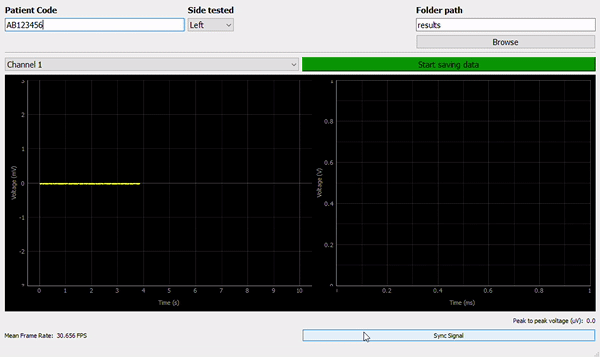
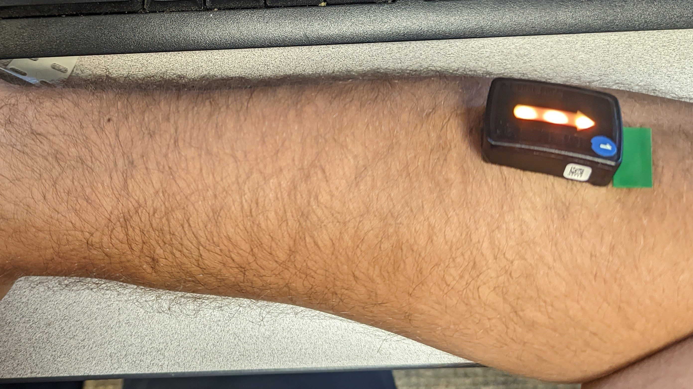
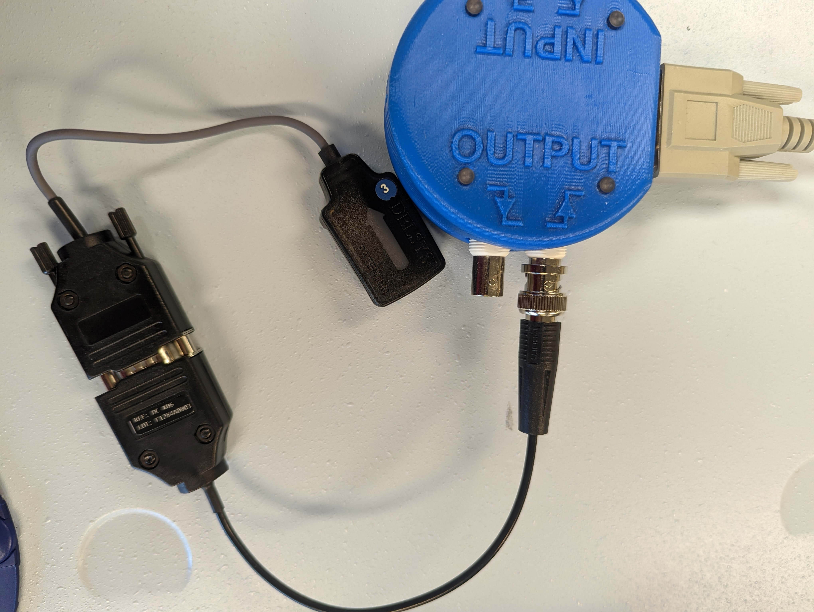

# TMS and Trigno Lite

GUI that streams from the [Trigno Lite](https://delsys.com/trigno-lite/) system and can receive stim signals from a TMS machine to detect Motor Evoked Potentials (MEPs).

The gif below shows the usual function of the GUI. The left panel shows 10 seconds of the current EMG signal from Channel 1 (though it can be changed to other channels), and the pannel on the right shows 100ms worth of data starting from the moment the TMS sync signal is received. 



## Software and Hardware requirements

The project was extensively tested using Python 3.8 and Windows 10. The specific python packages required are shown in the file [requirements.txt](requirements.txt). It uses the Delsys API, but no other packages should need to be installed: this can run as a standalone program. The necessary libraries are included in the folder `lib`.

Sometimes the operating system blocks the libraries that were downloaded from the internet, and so a process is needed to make sure that the libraries downloaded with this repository are usable. To do that, we would need to run the following:

```bash
cd repo/bin
streams.exe -d ..\lib\*
```

The hardware requirements are the following:

1. [Trigno lite system](https://delsys.com/trigno-lite/)
2. [Avanti Analog Input Adapter](https://delsys.com/trigno-analog-adapter/)
3. Single channel BNC connection: found [here](https://delsys.com/trigno-analog-adapter/), connects the Avanti adapter to the TMS output.
4. TMS machine with a BNC rising edge output.

## Installation

To use the software, clone the repository and then install the Python requirements by doing:

```bash
git clone repo_url
cd repo
pip install -r requirements.txt
```

## Setup

To setup the system, first we need to place the EMG sensors on the muscles we are interested in testing. The image below shows EMG placement on the Extensor Carpi Radialis. Follow the instructions [here](https://delsys.com/downloads/TECHNICALNOTE/101-emg-sensor-placement.pdf) for more recommendations from Delsys. 


The Avanti analog input adapter must be connected to the rising edge output of the TMS system, as shown in the image below.


Finally, to make the system work properly, we need to copy the key and license files we should have received from Delsys into the `config` folder. They should be called `key` and `license.lic` respectively.

## Usage

To run the program, make sure that the sensors we want to use are already out of the base station and connected to it. Then, the program starts by running the following:

```bash
python tms_trigno.py
```

Make sure that the `python` version is 3.8 and that it has all the necessary packages installed.

### Modifying the GUI

The GUI was built using the [QT designer](https://doc.qt.io/qt-5/qtdesigner-manual.html). To modify it, we can open the designer which should have been installed as part of the requirements of the project. To open the interface, we must do:

```bash
# Go to wherever the python base directory for the interpreter we're using is.
# In the case of anaconda, it will be: 
cd C:\Users\[USER]\anaconda3\envs\[ENV_NAME]
# Then, open the designer
cd Lib\site-packages\qt5_applications\Qt\bin\
designer.exe
```
Inside the designer, open the QT file, available at [QT/tms_window.ui].

When all changes are ready, update the Python file from the designer file by doing:

```bash
pyuic5 -o QT/main_window.py QT/tms_window.ui
```

## Known issues and future work

Getting a constant frame rate from the GUI is challenging. Right now, it is based on a QT timer that runs every 30ms. However, we discovered that if we don't print the time it takes for the plot update method to run, then the GUI as a whole slows down. Some digging will need to be done to avoid the printing while maintaining the frame rate.

## License

See the [License.md](License.md) file for license rights and limitations (MIT).